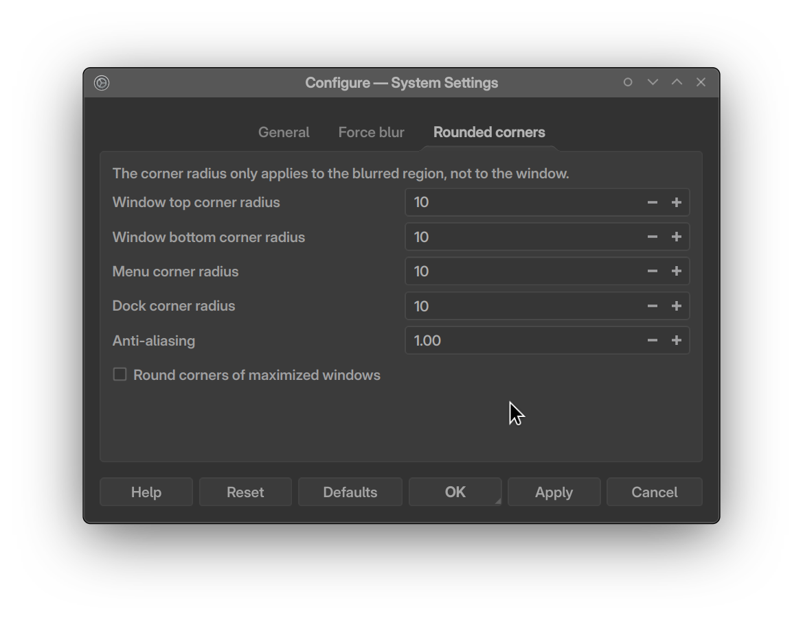

# Zephyr Theme Wiki
A brief guide to setup the entire Zephyr stack

> [!NOTE]
> Before doing anything, make sure to have backups in place. I assume you absolutely know what you're doing. Although, there is nothing to worry about, but it's always a good idea to have backups.

## Repos
- Window decoration: [KustomBreezeEnhanced](https://github.com/Rudraksh88/KustomBreezeEnhanced) (personal fork)
- [MusiK Plasmoid](https://github.com/Rudraksh88/musik-plasmoid)
- Icon Theme: [Zephyr Icons](https://github.com/Rudraksh88/zephyr-icons)
- Plasma Style: [Zephyr](https://github.com/Rudraksh88/zephyr-plasma-style)

#### Desktop Effects
- **KDE-Rounded-Corners** (In this repo)
    Fork that fixes the primary outline blend mode. For now, use the fork. Will raise a PR later.
    Original author: [matinlotfali](https://github.com/matinlotfali/KDE-Rounded-Corners)
- [**Force Blur / Better Blur**](https://github.com/taj-ny/kwin-effects-forceblur)

## Guide
All the linked repos have a `README.md` file that contains the installation instructions. You can install them in any order, or follow the order below:

1. Setting up the Window Decoration:
   - After installing, here's the config that I use:

    - Enable Animations. Duration: 150ms.
    - Shadow size: Very Large & Strength: 100%

2. Install the icon theme
3. Install the plasma style
4. Install the `Zephyr.colors` (Color scheme) to `~/.local/share/color-schemes`. Apply the color scheme from `System Settings > Colors & Themes > Colors`.
5. Setting up the MusiK plasmoid
    - Install the plasmoid.
    - Install [Hubot Sans](https://github.com/github/hubot-sans) font.
        For the song name, I used `Hubot Sans Bold Condensed`. But this didn't persist during reboot/session change because of some conflict with the font style name. I had to create a new font with a different name using `FontForge` and then install it. The font's included in this repo. Try to use a discrete listing of the font name if this is the case.
    - Config:
        Refer to `musik-config.md` or the following below:
        - Enable show hover background
        - Full Player:
            - Song name custom font: `19pt Size`, `Hubot Sans Bold Condensed`
            - Artist name custom font: `10pt Size`, `Hubot Sans Expanded ExtraBold` - Use this discrete listing.
            - Time labels: `10pt Size`, `Inter Display SemiBold` - Use this discrete listing.
        - Accent colors
            - Use from Album cover
            - Show on Artist name
            - Show on Buttons
            - Show on Progress bar (on hover)
        - Spacing
            Before album cover: `4`
            Album cover radius: `3`

            Text elements
            - Before song name: `5`
            - After song name: `-5`
            - After artist name: `4`

            Player controls
            - Before player controls: `10`
            - After player controls: `48`

            Spacing between buttons
            - Main controls spacing: `22`
            - Full row spacing: `32`
        - Enable Audio vizualization
        - Panel song max width: `230`
        - Scroll text only on hover
6. Setting up the Kwin effects
    - Install the effects.
    - Enable the effects in `System Settings > Desktop Effects`
    - KDE Rounded Corners:
        - Disable roundness on tile and maximize
        - Both Radius: `7`
        - Outlines:
        
        - Include/Exclude applications as per your preference.
    These settings are stored in `~/.config/kwinrc` file.

    - Force Blur:
        - Blur strength:
        
        - Blur apps list:
        
        - Rounded corners:
        

7. Setting up the panel
    - Panel height: `36` (or as per your preference)
    - Items from left to right:
        - Application launcher (Kickoff).
        I've added a width setting. Increase this so that the icon is corner clickable.
        - MusiK plasmoid
        - Spacer (flexible)
        - Task manager
        - Spacer (Flexible)
        - System tray
        - Digit Clock

8. Copying the system plasmoids
> [!NOTE]
> Before copying the system plasmoids, make sure to backup your current plasmoids. You can do this by running the following command in the terminal:
```bash
cp -r /usr/share/plasma/plasmoids <backup_directory>
```
> Replace `<backup_directory>` with the path to the directory where you want to store the backup.

- Copy (effectively replacing) the system plasmoids from `system-plasmoids` directory to `/usr/share/plasma/plasmoids/`
```bash
sudo true; # To prompt for sudo only once
echo "Starting to copy system plasmoids..."
for i in system-plasmoids/*; do
    plasmoid_name=$(basename "$i")
    echo "Copying plasmoid: $plasmoid_name"
    sudo cp -r "$i" /usr/share/plasma/plasmoids/
    echo "✓ Successfully copied $plasmoid_name"
    echo ""
done
echo "All plasmoids have been copied successfully!"
```

9. Log out and log back, or restart your system to apply the changes. Or you can even just restart the compositor by running the following command:
```bash
kwin_wayland --replace
```
10. Enjoy the new look of your KDE Plasma desktop environment!

## Support
If after this, you love the look of your new desktop, you can consider providing a treat — coffee, snacks  and beer accepted. Donations may unlock bonus content (or at least a grin). If not, that's okay too. Just enjoy!

[](https://www.buymeacoffee.com/rudraksh.tripathi)

[](https://www.paypal.me/rudrakshtripathi)

**Only for India** UPI: `rudraksh-tripathi@ibl`

## Discord
Join the [Discord server](https://discord.gg/9hfsgs3v) in case you need any help or want to discuss anything related to the theme.